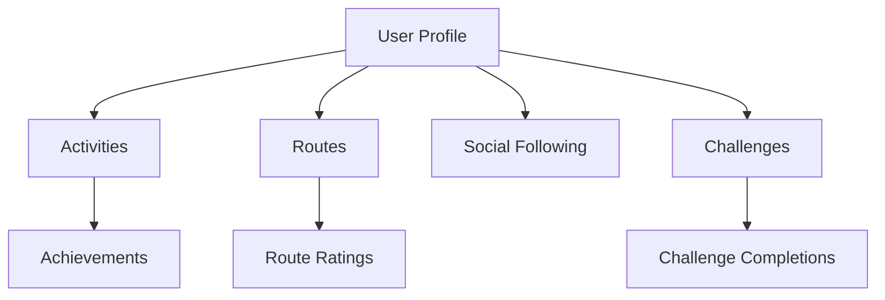

# StepNest Walking Tracker

A decentralized platform for tracking, verifying, and sharing walking and hiking activities on the Stacks blockchain. StepNest enables users to record their activities, share routes, participate in challenges, and earn achievements while maintaining ownership of their fitness data.

## Overview

StepNest combines fitness tracking with social features to create a trustless, community-driven walking and hiking platform. Key features include:

- User profiles with verified activity tracking
- Route sharing and discovery system
- Social following and community engagement
- Challenge participation and completion tracking
- Achievement system with reputation points
- Privacy controls for activities and routes

## Architecture

The platform is built on a single core smart contract that manages all platform functionality:



The contract utilizes several key data structures:
- Users: Profile information and statistics
- Activities: Individual walking/hiking records
- Routes: Shared paths and trails
- Challenges: Community fitness goals
- Social connections: Following relationships

## Contract Documentation

### Core Features

#### User Management
- User registration and profile management
- Privacy settings control
- Reputation scoring system
- Achievement tracking

#### Activity Tracking
- Record verified walking/hiking activities
- Link activities to shared routes
- Privacy controls for activity visibility
- Automatic statistics updates

#### Route Management
- Create and share walking/hiking routes
- Route rating and review system
- Route discovery with tags
- Privacy settings for routes

#### Social Features
- Follow other users
- Share activities and routes
- Community engagement through ratings
- Activity feed privacy controls

#### Challenges
- Create and join community challenges
- Track progress and completions
- Time-bound goal setting
- Automatic reward distribution

## Getting Started

### Prerequisites
- Clarinet
- Stacks wallet
- Basic understanding of Clarity

### Basic Usage

1. Register a new user:
```clarity
(contract-call? .step-nest register-user "username" "bio" "public")
```

2. Record an activity:
```clarity
(contract-call? .step-nest record-activity none u1234567890 u1234568890 u5000 u100 u6000 "{\"coordinates\":[...]}" "public")
```

3. Create a route:
```clarity
(contract-call? .step-nest create-route "Mountain Trail" "Scenic mountain path" "Mountain Range" u5000 u300 u3 "{\"coordinates\":[...]}" "public" (list "mountain" "scenic"))
```

## Function Reference

### User Management

```clarity
(register-user (username (string-ascii 30)) (bio (string-utf8 500)) (privacy (string-ascii 10)))
(update-profile (username (string-ascii 30)) (bio (string-utf8 500)) (privacy (string-ascii 10)))
```

### Activity Recording

```clarity
(record-activity (route-id (optional uint)) (start-time uint) (end-time uint) (distance uint) (elevation-gain uint) (steps uint) (route-data (string-utf8 10000)) (privacy (string-ascii 10)))
```

### Route Management

```clarity
(create-route (name (string-utf8 100)) (description (string-utf8 1000)) (location (string-utf8 100)) (distance uint) (elevation-gain uint) (difficulty uint) (route-data (string-utf8 10000)) (privacy (string-ascii 10)) (tags (list 10 (string-ascii 20))))
(rate-route (route-id uint) (rating uint) (comment (string-utf8 500)))
```

### Social Interactions

```clarity
(follow-user (user-to-follow principal))
(unfollow-user (user-to-unfollow principal))
```

### Challenge System

```clarity
(create-challenge (name (string-utf8 100)) (description (string-utf8 1000)) (start-date uint) (end-date uint) (goal-type (string-ascii 20)) (goal-value uint))
(join-challenge (challenge-id uint))
(update-challenge-progress (challenge-id uint) (progress uint))
```

## Development

### Testing
1. Clone the repository
2. Install Clarinet
3. Run `clarinet test` to execute test suite

### Local Development
1. Start Clarinet console: `clarinet console`
2. Deploy contract: `(contract-call? .step-nest ...)` 

## Security Considerations

### Data Privacy
- All activities and routes have configurable privacy settings
- User data is stored on-chain - consider data minimization
- Profile privacy settings control data visibility

### Access Control
- Function calls are authenticated using tx-sender
- Route ownership verification for modifications
- Challenge participation verification

### Limitations
- GPS data stored as JSON strings - validate client-side
- Activity verification relies on client integrity
- Challenge progress updates require manual triggers